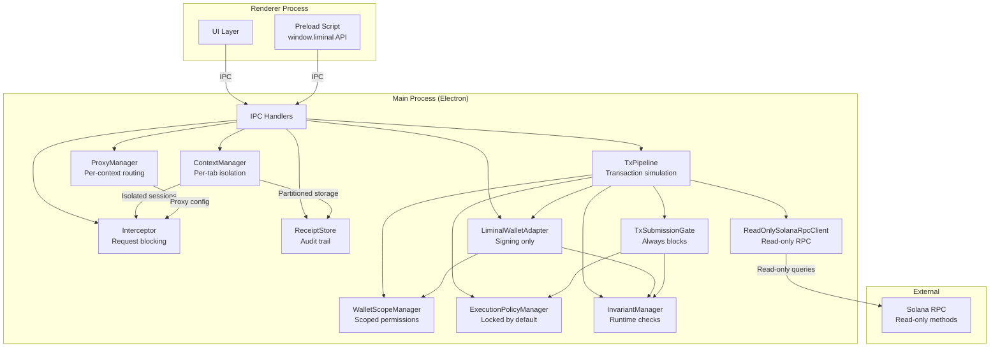
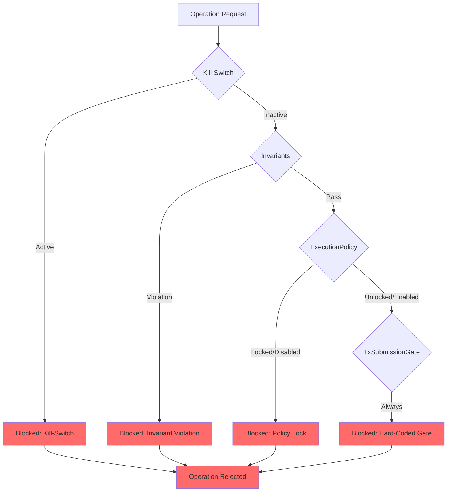
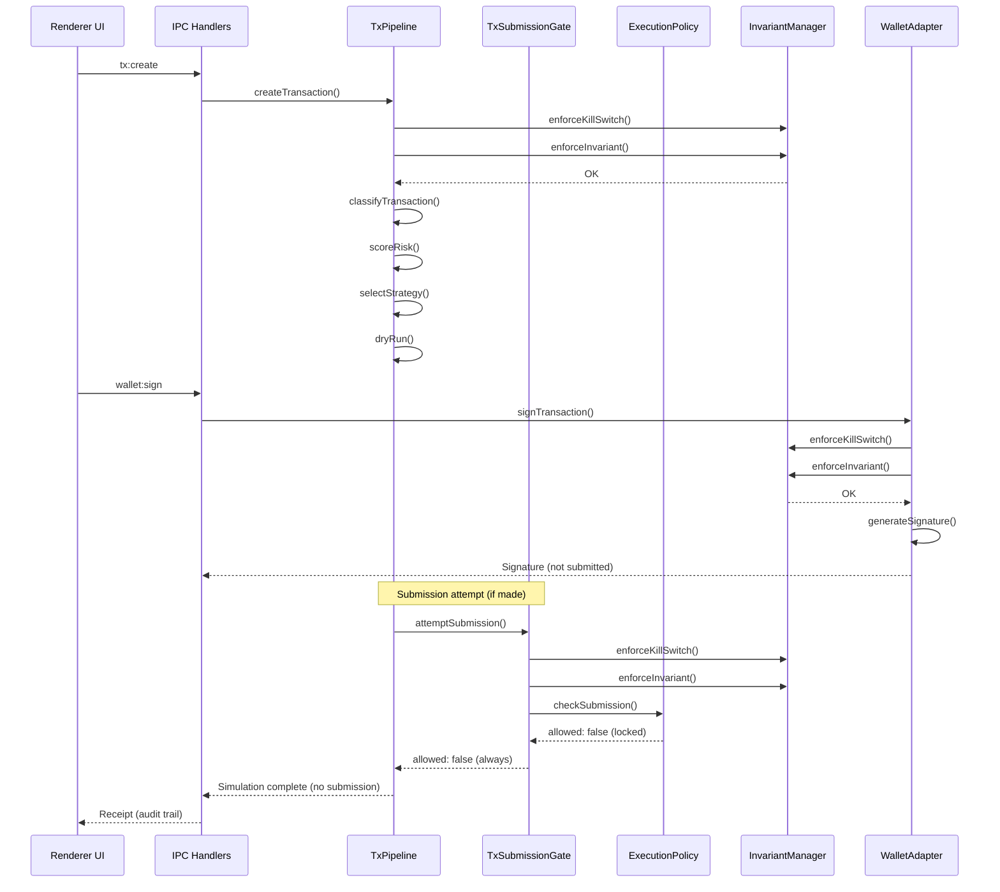
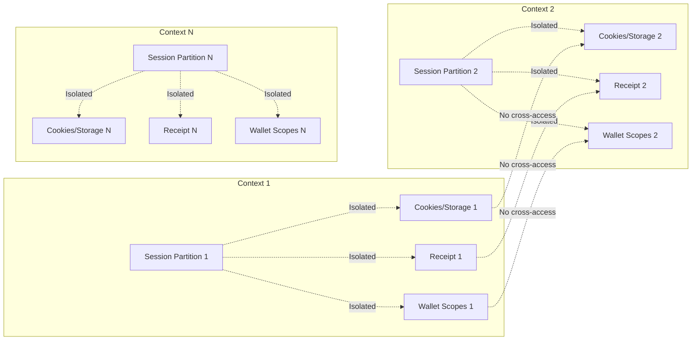

# Liminal Architecture & Safety Diagrams

**Phase 3.10 - Frozen**

This document provides architecture and safety diagrams for Liminal.

---

## High-Level Architecture

**Key Components:**
- **ContextManager**: Creates isolated browser contexts (session partitions)
- **Interceptor**: Blocks and logs requests per context
- **ProxyManager**: Manages per-context proxy routing
- **ReceiptStore**: Stores privacy receipts (audit trail)
- **TxPipeline**: Orchestrates transaction simulation (dry-run only)
- **LiminalWalletAdapter**: Provides scoped signing (no submission)
- **TxSubmissionGate**: Hard-coded block (always returns false)
- **ExecutionPolicyManager**: Locked policy (flags default to false)
- **InvariantManager**: Runtime safety checks (fail-fast)
- **ReadOnlySolanaRpcClient**: Read-only RPC access (no submission methods)

---

## Safety Defense-in-Depth

**Protection Layers:**

1. **Kill-Switch (Layer 1 - Global Override)**
   - Checked FIRST at all enforcement points
   - If active, blocks ALL operations immediately
   - Overrides all other checks
   - Location: `InvariantManager.enforceKillSwitch()`

2. **Invariants (Layer 2 - Runtime Checks)**
   - Enforced at module entry points
   - Fail-fast (throw on violation)
   - Checked BEFORE operations
   - Location: `InvariantManager.enforceInvariant()`

3. **ExecutionPolicy (Layer 3 - Policy Lock)**
   - Flags default to `false` (hard-coded)
   - Policy is `LOCKED` by default
   - Change attempts don't work (Phase 3.7)
   - Location: `ExecutionPolicyManager.checkSubmission()`

4. **TxSubmissionGate (Layer 4 - Hard-Coded Block)**
   - Always returns `allowed: false` (hard-coded)
   - Multiple explicit throw methods
   - Cannot be changed without code modification
   - Location: `TxSubmissionGate.attemptSubmission()`

5. **PhaseFreeze (Layer 5 - Declaration)**
   - Phase 3.10 is frozen (read-only)
   - Freeze status is queryable
   - Location: `PhaseFreeze.enforceFreeze()`

**Defense-in-Depth Principle:**
Even if one layer is bypassed, other layers will block the operation. No single point of failure.

---

## Transaction Flow (Phase 3 - Simulation Only)

**Key Points:**
- All operations go through safety layers
- Kill-switch checked FIRST
- Invariants checked BEFORE operations
- Policy checked at gate level
- Gate ALWAYS blocks (hard-coded)
- Signing produces signatures but does NOT submit
- Receipts are audit trail only (not execution data)

---

## Context Isolation

**Isolation Mechanisms:**
- Electron session partitions (`session.fromPartition`)
- Context-scoped data storage
- Per-context proxy routing
- Per-origin, per-context wallet scopes
- No cross-context data access

---

## Notes

- All diagrams represent Phase 3.10 (Frozen)
- No code execution is modified by these diagrams
- Diagrams are documentation only
- For implementation details, see source code in `src/main/modules/`

